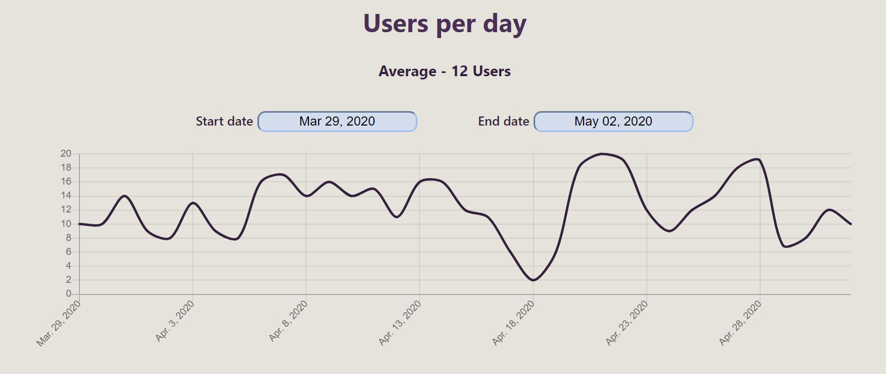
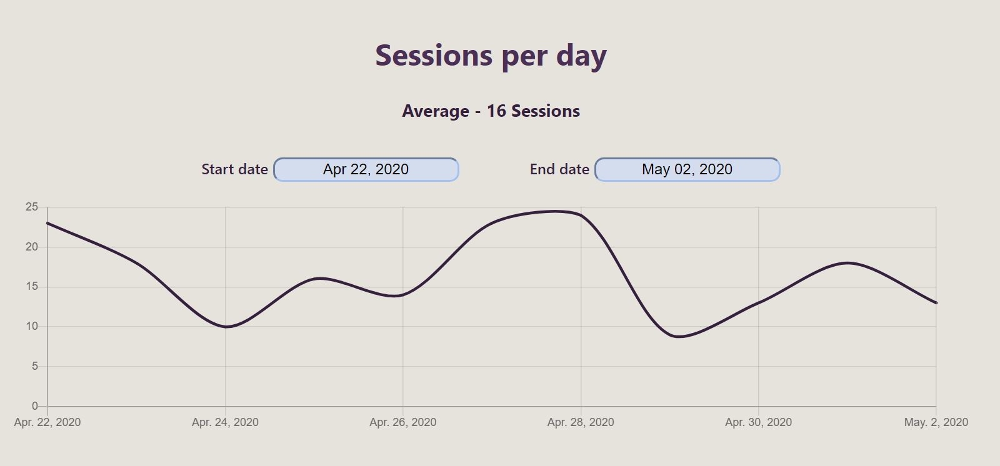
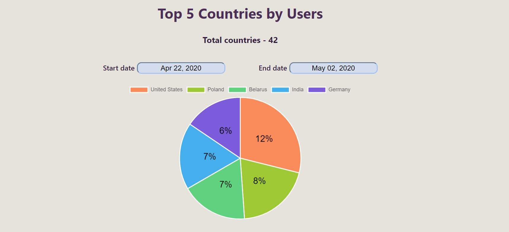
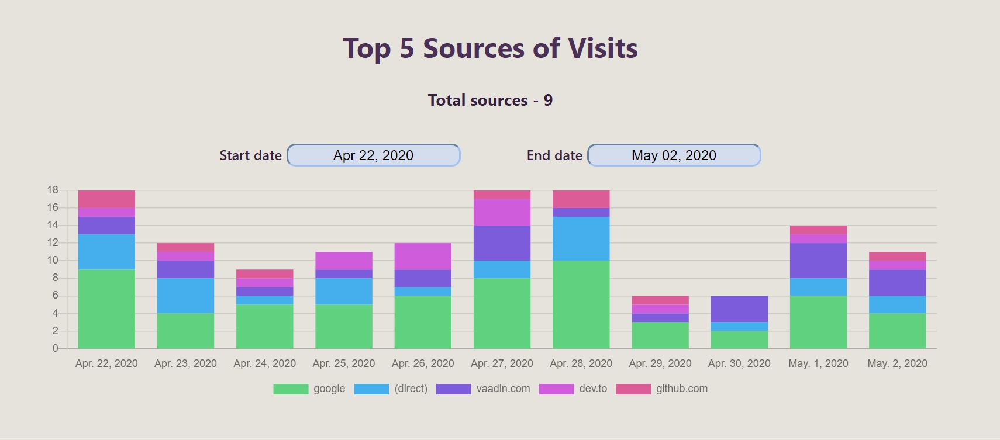
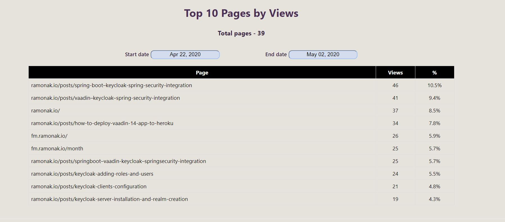
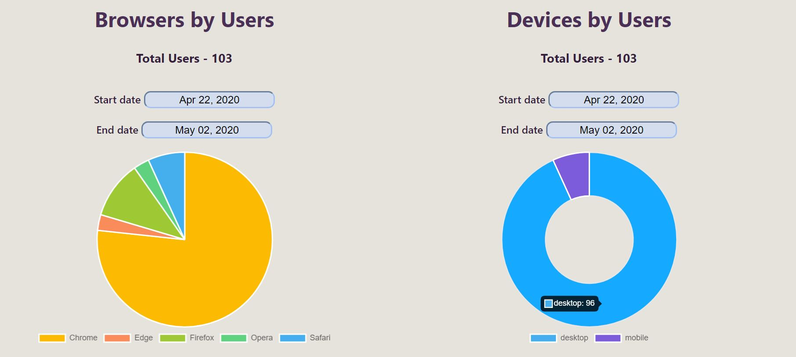

# Custom Google Analytics Dashboard

Custom Google Analytics Dashboard based on Google Analytics Reporting API v4 with OAuth2, charts and tables.

    
    
    
    
    
    

## Technologies used

- [React.js](https://reactjs.org/)
- [Google Analytics API](https://developers.google.com/analytics/devguides/reporting/core/v4)
- [React Charts](https://github.com/jerairrest/react-chartjs-2)
- [Styled Components](https://styled-components.com/)

## Run the app locally

1. Clone this repo
2. Create project in [Google Developers Console](https://console.developers.google.com/)
3. Enable Google Analytics Reporting API.
4. Configure Google OAuth consent screen.
5. Add your CLIENT_ID into .env file:
   REACT_APP_CLIENT_ID='YOUR_CLIENT_ID'
6. Run `npm install`
7. Run `npm start`

This project was bootstrapped with [Create React App](https://github.com/facebook/create-react-app).

The blog post [How to develop a custom Google Analytics Dashboard using Google Analytics Reporting API v4 and React.js (VERSION 2020)](https://ramonak.io/posts/react-google-analytics-dashboard).
